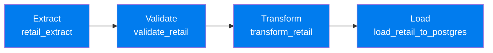

<div align="center">

# 📊 Big Data Analysis on Online Retail Data

### An end-to-end Big Data pipeline on the UCI **Online Retail II** dataset

_SQL & NoSQL design · PySpark distributed processing · Dockerized Airflow &
Kafka streaming_

[](#)
[](#)
[](#)
[](#)
[](#)
[](#)

</div>

---

## 📌 Overview

This repository is a **capstone Big Data & Cloud Computing project** that takes
a single real-world retail dataset and pushes it through a complete, connected
pipeline — from a raw spreadsheet, into relational and document databases,
through large-scale distributed processing, and finally into a containerised
orchestration and real-time streaming environment.

> **Guiding question:** _Where does the revenue come from, and how does it move
> through the year?_

The dataset is the
[UCI Online Retail II](https://archive.ics.uci.edu/dataset/502/online+retail+ii)
dataset (CC BY 4.0) — real transactions from a UK-based, non-store online
retailer of all-occasion gift-ware, spanning **December 2009 – December 2011**.
After cleaning, the working dataset contains **1,033,036 rows** across **5,942
unique customers**. The data is pseudonymised throughout — customers are
represented only by a numeric `CustomerID`, with no names, emails, or addresses.


Every service runs inside its own **Docker container**, so the whole stack is
portable and reproducible on any machine.

---

## 🗺️ Repository structure

```text
Big Data Project/
├── Big_Data_Capstone_Report.docx        # Full written capstone report
├── README.md                            # You are here
│
├── Task 1/                              # SQL & NoSQL
│   ├── Task1_sql_analysis.ipynb         # Cleaning, PostgreSQL load, SQL analysis
│   └── Task1_mongodb_design_brief.md    # MongoDB document-model design brief
│
├── Task 2/                              # PySpark big-data processing
│   └── task2_pyspark.ipynb              # Spark ETL, KPIs, partitioning demo
│
└── Task 3/Task3/                        # Docker · Airflow · Kafka
    ├── airflow 2/airflow/
    │   ├── dags/                        # retail_etl_pipeline.py (Extract→Validate→Transform→Load)
    │   ├── docker-compose.yml
    │   └── requirements.txt
    ├── kafka_retail/
    │   ├── docker-compose.yml           # Kafka + ZooKeeper + Kafdrop
    │   ├── retail_producer.py           # Publishes JSON transaction events
    │   └── retail_consumer.py           # Flags high-value events, windowed counts
    └── online_retail_II(Year 2009-2010).csv
```

---

## 🧩 Task 1 — SQL & NoSQL

**Relational design (PostgreSQL).** The cleaned dataset is loaded into a
**normalised, four-table schema** — `customers`, `products`, `invoices`,
`invoice_items` — connected by primary/foreign keys so no data is duplicated and
each query joins only what it needs.

**Analysis highlights:**

| # | Query                         | What it shows                                                                                                                                |
| - | ----------------------------- | -------------------------------------------------------------------------------------------------------------------------------------------- |
| 1 | Data ingestion & verification | `COUNT` checks across all 4 tables confirm 1,033,036 rows loaded correctly                                                                   |
| 2 | Revenue by country            | Joins + `GROUP BY`/`SUM`, excluding cancellations & invalid rows → **UK dominates at £17.8M** (27× the next market)                          |
| 3 | Monthly sales trend           | `DATE_TRUNC` + window functions (`LAG`, `SUM() OVER`) for month-over-month comparison and running totals → clear **Oct–Nov peaks** each year |
| 4 | Query performance & indexing  | `EXPLAIN ANALYSE` before/after an index on `stock_code` → full scan ➜ index scan, **4.35× faster (−77% time)**                               |

**Document design (MongoDB).** A complementary, invoice-centred document model
is proposed: **one invoice per document**, with line items embedded in an
`items` array (invoice number as `_id`), so a full invoice can be returned as
JSON without joining four collections.

```json
{
    "_id": "489434",
    "invoice_date": "2009-12-01T07:45:00Z",
    "is_cancelled": false,
    "customer": { "customer_id": 13085, "country": "United Kingdom" },
    "items": [
        {
            "stock_code": "85048",
            "description": "15CM CHRISTMAS GLASS BALL 20 LIGHTS",
            "quantity": 12,
            "unit_price": 6.95,
            "line_total": 83.40
        }
    ]
}
```

Descriptions and countries are stored as **historical snapshots**, so later
changes never rewrite past invoices. PostgreSQL remains the authoritative system
for cross-invoice analytics; MongoDB serves fast, application-facing invoice
reads. Under the **CAP theorem**, the design favours **consistency + partition
tolerance** (majority write concern) — refusing writes during a partition rather
than risking conflicting invoice totals.

📄 Full design brief:
[`Task 1/Task1_mongodb_design_brief.md`](Task%201/Task1_mongodb_design_brief.md)
📓 Full analysis notebook:
[`Task 1/Task1_sql_analysis.ipynb`](Task%201/Task1_sql_analysis.ipynb)

---

## ⚡ Task 2 — PySpark Big-Data Processing

The four normalised Task 1 tables are read out of PostgreSQL **via JDBC** into
Spark, joined into a single flat `fact_raw` DataFrame (**1,033,036 rows** — well
past the 500k requirement), then cleaned and enriched entirely with **Spark
DataFrame operations** (not Pandas):

- 💰 `revenue = quantity × unit_price`
- 🗓️ date parts (year / month / day / hour) extracted from invoice dates
- 🌍 `country_clean` — standardises abbreviations/placeholders so country KPIs
  don't fragment

**Five business KPIs**, computed in Spark:

| KPI                         | Result                                                     |
| --------------------------- | ---------------------------------------------------------- |
| Revenue & invoices by month | Peaks every **November**                                   |
| Average order value         | **£448.16**                                                |
| Top 10 customers by spend   | Top customer: **£587,301**                                 |
| Revenue by country          | UK **£17.65M**; top international market Ireland **£646k** |
| Cancellation rate           | **15.5%** of invoices cancelled                            |

**Performance demo — partition pruning.** The fact table is written to **Parquet
partitioned by year/month**. A single-month filter query's `.explain()` shows
`PartitionFilters` pushed down to file-listing, and the Spark UI confirms **only
1 partition read** — a concrete, production-scale-relevant optimisation.

> _Why Spark for a ~1M-row dataset?_ The lazy DataFrame code demonstrated here
> scales unchanged to a real cluster. The honest trade-off: JVM/shuffle overhead
> isn't "worth it" for raw speed at this size — the value is in demonstrating an
> approach that scales.

📓 Notebook: [`Task 2/task2_pyspark.ipynb`](Task%202/task2_pyspark.ipynb)

---

## 🐳 Task 3 — Docker, Airflow & Kafka

A fully containerised retail pipeline combining **batch orchestration** and
**real-time streaming**, deployed with Docker Compose.

### Batch ETL — Apache Airflow



The `retail_etl_to_postgres` DAG reads the retail CSV, validates required
fields, computes a `Revenue` column, and loads the results into a
`retail_transactions` table in PostgreSQL — confirmed via the Airflow UI and a
verifying `SELECT`.

### Real-time streaming — Apache Kafka

- A **producer** (`retail_producer.py`) serialises transaction events as JSON
  and publishes them to the `retail_transactions` topic
- **Kafdrop** provides a web UI to monitor topics, offsets, and messages
- A **consumer** (`retail_consumer.py`) subscribes to the topic, flags any
  transaction with `Revenue ≥ 20` as **high-value**, and counts messages in a
  rolling 10-second window

### Evidence summary

| # | Component          | Evidence                                                            |
| - | ------------------ | ------------------------------------------------------------------- |
| 1 | Docker environment | All Airflow & Kafka containers active in Docker Desktop             |
| 2 | Airflow DAG        | 4-stage DAG: Extract → Validate → Transform → Load                  |
| 3 | Airflow execution  | Latest run completed with **zero failed tasks**                     |
| 4 | PostgreSQL output  | `retail_transactions` table holds processed records incl. `Revenue` |
| 5 | Kafka topic        | `retail_transactions` topic visible in Kafdrop                      |
| 6 | Kafka producer     | Events published & confirmed                                        |
| 7 | Kafka verification | Kafdrop shows messages with offsets                                 |
| 8 | Kafka consumer     | High-value flagging + 10s windowed counting                         |

📂 DAGs:
[`Task 3/Task3/airflow 2/airflow/dags/`](Task%203/Task3/airflow%202/airflow/dags/)
📂 Kafka scripts: [`Task 3/Task3/kafka_retail/`](Task%203/Task3/kafka_retail/)

---

## 🧮 The 5 V's of Big Data in this project

| Task                    | Volume | Velocity | Variety | Veracity | Value |
| ----------------------- | :----: | :------: | :-----: | :------: | :---: |
| **1 — SQL & NoSQL**     |   ✅   |    —     |   ✅    |    ✅    |  ✅   |
| **2 — PySpark**         |   ✅   |    —     |   ✅    |    —     |  ✅   |
| **3 — Airflow & Kafka** |   —    |    ✅    |    —    |    ✅    |  ✅   |

- **Volume** — 1,033,036 cleaned transaction records across databases and Spark
- **Velocity** — real-time event flow through Kafka's producer → topic →
  consumer
- **Variety** — relational tables, Spark DataFrames, and streaming JSON events
- **Veracity** — data cleaning + Airflow's dedicated validation stage
- **Value** — SQL business analysis, Spark KPIs/trends, rule-based streaming
  alerts

---

## 🌱 Sustainability, cost & GDPR

- **Cost & sustainability** — the ~43.5MB / ~1M-row dataset was processed
  **entirely locally in Docker** rather than on paid cloud infrastructure,
  avoiding both unnecessary spend and the energy footprint of over-provisioned
  cloud compute. _(Trade-off: this wouldn't scale to hundreds of millions of
  rows — a managed cloud cluster would then be the sensible choice.)_
- **Data protection** — the dataset is pseudonymised (numeric `CustomerID` only,
  no PII), enabling data minimisation by design. Historic UK-origin data avoids
  GDPR cross-border transfer concerns.
- **Access control** — credentials are kept out of the repository via
  configuration rather than hard-coded secrets, with basic Airflow run logging
  in place.
- **Key limitation** — re-identification risk: even pseudonymised data can be
  linked back to individuals when combined with other sources, so a production
  system would isolate and tightly control the `CustomerID` mapping.

---

## 🚀 Getting started

> **Prerequisites:** Docker Desktop, Python 3.10+, Java 11 (for local PySpark),
> Jupyter

<details>
<summary><b>1. SQL & NoSQL (Task 1)</b></summary>

```bash
cd "Task 1"
jupyter notebook Task1_sql_analysis.ipynb
```

Requires a running PostgreSQL instance — update connection settings in the
notebook's config cell.

</details>

<details>
<summary><b>2. PySpark (Task 2)</b></summary>

```bash
cd "Task 2"
jupyter notebook task2_pyspark.ipynb
```

Requires `JAVA_HOME`, the PostgreSQL JDBC driver, and (on Windows)
`HADOOP_HOME`/`winutils` set up before the notebook starts its `SparkSession`.

</details>

<details>
<summary><b>3. Docker · Airflow · Kafka (Task 3)</b></summary>

```bash
# Airflow (batch ETL)
cd "Task 3/Task3/airflow 2/airflow"
docker compose up -d
# → Airflow UI: http://localhost:8080

# Kafka + Kafdrop (streaming)
cd "../../kafka_retail"
docker compose up -d
# → Kafdrop UI: http://localhost:9000

python retail_producer.py    # publish sample events
python retail_consumer.py    # consume, flag high-value, count in windows
```

</details>

---

## 👥 Team

| Member                       | Responsibility                                                 |
| ---------------------------- | -------------------------------------------------------------- |
| **Ayesha Ameen**             | Architecture, cross-cutting GDPR & sustainability, limitations |
| **Mahnoor Hashim**           | Task 1 — SQL & NoSQL                                           |
| **Muhammad Vahaj Ur Rehman** | Task 2 — PySpark big-data processing                           |
| **Amal Alkaff**              | Task 3 — Docker, Airflow & Kafka                               |

---

## 📚 Dataset & license

- **Dataset:**
  [UCI Online Retail II](https://archive.ics.uci.edu/dataset/502/online+retail+ii)
  — Creative Commons Attribution 4.0
- **Full report:**
  [`Big_Data_Capstone_Report.docx`](Big_Data_Capstone_Report.docx)

<div align="center">

_Built as a Big Data & Cloud Computing capstone project._

</div>
