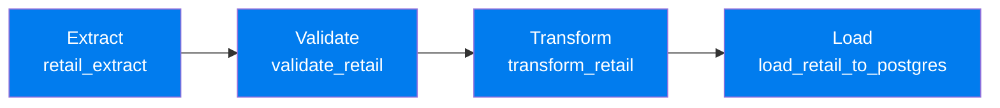

The `retail_etl_to_postgres` DAG reads the retail CSV, validates required fields, computes a `Revenue` column, and loads the results into a `retail_transactions` table in PostgreSQL — confirmed via the Airflow UI and a verifying `SELECT`.

### Real-time streaming — Apache Kafka

- A **producer** (`retail_producer.py`) serialises transaction events as JSON and publishes them to the `retail_transactions` topic
- **Kafdrop** provides a web UI to monitor topics, offsets, and messages
- A **consumer** (`retail_consumer.py`) subscribes to the topic, flags any transaction with `Revenue ≥ 20` as **high-value**, and counts messages in a rolling 10-second window

### Evidence summary

| # | Component | Evidence |
|---|-----------|----------|
| 1 | Docker environment | All Airflow & Kafka containers active in Docker Desktop |
| 2 | Airflow DAG | 4-stage DAG: Extract → Validate → Transform → Load |
| 3 | Airflow execution | Latest run completed with **zero failed tasks** |
| 4 | PostgreSQL output | `retail_transactions` table holds processed records incl. `Revenue` |
| 5 | Kafka topic | `retail_transactions` topic visible in Kafdrop |
| 6 | Kafka producer | Events published & confirmed |
| 7 | Kafka verification | Kafdrop shows messages with offsets |
| 8 | Kafka consumer | High-value flagging + 10s windowed counting |

📂 DAGs: [`Task 3/Task3/airflow 2/airflow/dags/`](Task%203/Task3/airflow%202/airflow/dags/)
📂 Kafka scripts: [`Task 3/Task3/kafka_retail/`](Task%203/Task3/kafka_retail/)

---

## 🧮 The 5 V's of Big Data in this project

| Task | Volume | Velocity | Variety | Veracity | Value |
|------|:---:|:---:|:---:|:---:|:---:|
| **1 — SQL & NoSQL** | ✅ | — | ✅ | ✅ | ✅ |
| **2 — PySpark** | ✅ | — | ✅ | — | ✅ |
| **3 — Airflow & Kafka** | — | ✅ | — | ✅ | ✅ |

- **Volume** — 1,033,036 cleaned transaction records across databases and Spark
- **Velocity** — real-time event flow through Kafka's producer → topic → consumer
- **Variety** — relational tables, Spark DataFrames, and streaming JSON events
- **Veracity** — data cleaning + Airflow's dedicated validation stage
- **Value** — SQL business analysis, Spark KPIs/trends, rule-based streaming alerts

---

## 🌱 Sustainability, cost & GDPR

- **Cost & sustainability** — the ~43.5MB / ~1M-row dataset was processed **entirely locally in Docker** rather than on paid cloud infrastructure, avoiding both unnecessary spend and the energy footprint of over-provisioned cloud compute. *(Trade-off: this wouldn't scale to hundreds of millions of rows — a managed cloud cluster would then be the sensible choice.)*
- **Data protection** — the dataset is pseudonymised (numeric `CustomerID` only, no PII), enabling data minimisation by design. Historic UK-origin data avoids GDPR cross-border transfer concerns.
- **Access control** — credentials are kept out of the repository via configuration rather than hard-coded secrets, with basic Airflow run logging in place.
- **Key limitation** — re-identification risk: even pseudonymised data can be linked back to individuals when combined with other sources, so a production system would isolate and tightly control the `CustomerID` mapping.

